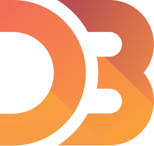

# Projet SportSee
<div align="center">

</div>

## À propos du projet

SportSee est une startup dédiée au coaching sportif.
En pleine croissance, l’entreprise va aujourd’hui lancer une nouvelle version de la page profil de l’utilisateur.
Cette page va notamment permettre à l’utilisateur de suivre le nombre de sessions réalisées ainsi que le nombre de calories brûlées.


## Fonctionnalités Principales

- Réalisation de la page profil utilisateur
- Affichage des données de l'utilisateur (nombre de sessions, nombre de calories brûlées, temps d'activité) sous forme de graphiques

## Outils utilisés
Projet réalisé avec React et D3.js

 

Lien Kanban : [Kanban](
    https://openclassrooms.notion.site/Tableau-de-bord-SportSee-6686aa4b5f44417881a4884c9af5669e)

## Installation

1. Cloner le dépôt
   ```sh
   git clone
    ```
2. Installer les dépendances
    ```sh
    npm install
    ```
3. Lancer le serveur
    ```sh
    npm run dev
    ```

## Le site

Vous pouvez également consulter le site live sur cette adresse : 


## Contact
[kseniyamudrakovadev@gmail.com](kseniyamudrakovadev@gmail.com)