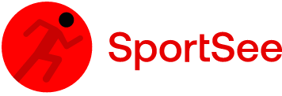

# Projet SportSee
<div align="center">



</div>

## About

SportSee is a startup dedicated to sports coaching. The rapidly growing company is now launching a new version of its user profile page. 
This page will allow users to track their activity and view their progress through interactive charts.

## Prerequisites

- [Node.js]
- Backend - [Docker]
- npm or yarn

## Main Features

- Display of user data (number of sessions, number of calories burned, activity time) in graph form

## Tech Stack
- React 18 / Vite / TypeScript
- React Router
- Recharts
- Sass (styling)

Lien Kanban : [Kanban](
    https://openclassrooms.notion.site/Tableau-de-bord-SportSee-6686aa4b5f44417881a4884c9af5669e)


## Installation

### 1. Clone the repository
```sh
git clone https://github.com/Kse-Nia/SportSee.git
cd sportsee
```

### 2. Backend setup
```sh
cd backend
docker compose up -d
```

The API will be available at `http://localhost:3000`


### 3. Frontend setup
```sh
cd frontend
cp .env.example .env
npm install
npm run dev
```

## Mock Data

The app includes a mock data mode (mockup.json) that can be toggled via the switch button
in the navbar, allowing development without running the backend.


## API Testing

A Postman collection is available in the folder `/postman`. 
Import the JSON file into Postman to test API endpoints.

Infrastructure:
- VPS hosted on OVH
- Docker containerized backend
- Custom domain

## Deployment and Access

The application is deployed on a VPS hosted on OVH. 
The backend is containerized using Docker, and the frontend is served using a custom domain.

You can access the deployed application at [https://sportsee.kseniya-mudrakova.fr](https://sportsee.kseniya-mudrakova.fr).

## Contact
[kseniyamudrakovadev@gmail.com](kseniyamudrakovadev@gmail.com)